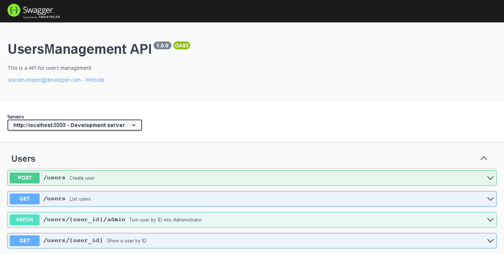

<h1 align="center">
UsersManagementAPI - Desafio 05 concluído - Documentação da API com Swagger
</h1>

## 💫 Sobre o desafio
Utilizando uma aplicação já funcional como base, realize a documentação das rotas com o Swagger.

## 🐱‍👤 Demostração

## ✅ Testes

## 🚀 Tecnologias 

---